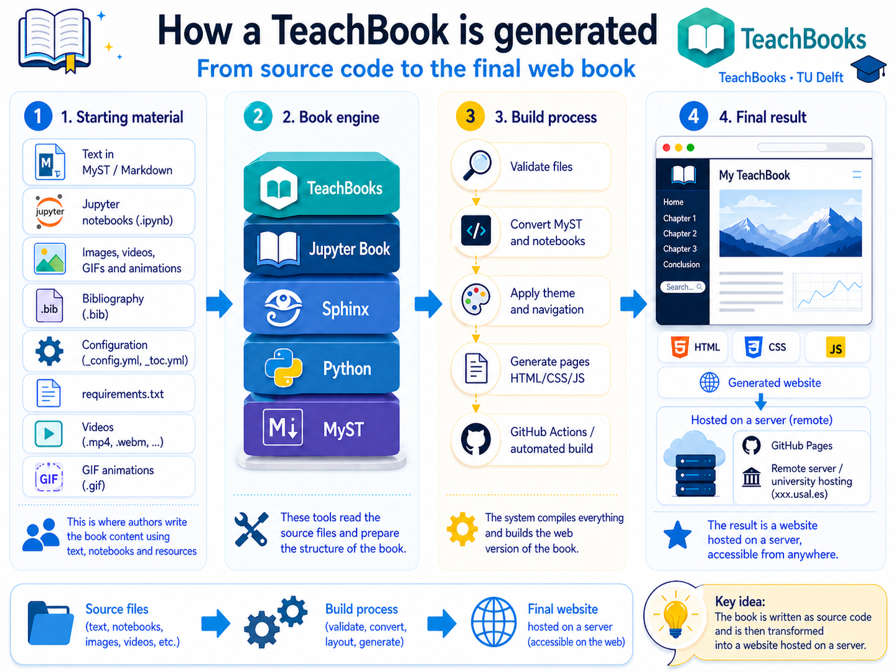
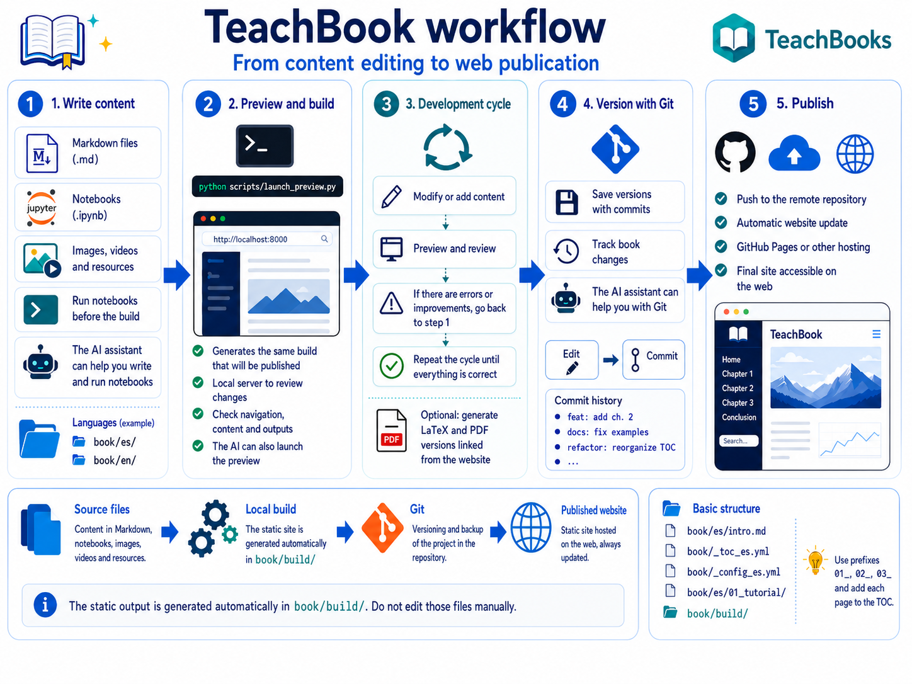
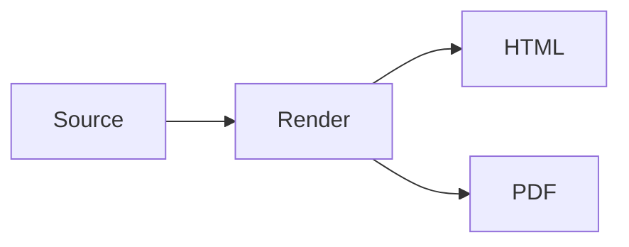
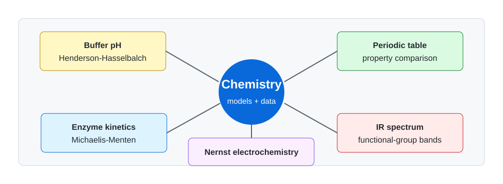

# Creating Electronic Books with Code and AI Assistants

<p class="subtitle">Teaching summary of the TeachBook and template</p>

---

# Contents

<div class="teachbook-grid">
  <div class="teachbook-card">
    <strong>1. What it is</strong>
    <span>A web book, PDF and related teaching materials from editable sources.</span>
  </div>
  <div class="teachbook-card">
    <strong>2. Workflow</strong>
    <span>Write, preview, version and publish.</span>
  </div>
  <div class="teachbook-card">
    <strong>3. Teaching content</strong>
    <span>Figures, equations, tables, citations, diagrams and multimedia.</span>
  </div>
  <div class="teachbook-card">
    <strong>4. Interactivity</strong>
    <span>Notebooks, Thebe, widgets, quizzes and lightweight HTML.</span>
  </div>
</div>

---

# The Core Idea

::div{class="teachbook-two-cols"}

::div
A TeachBook starts from simple files and generates a navigable teaching website.

- Markdown and notebooks as source files
- Shared static assets
- Per-language configuration
- Web and PDF outputs
::

::div
<figure class="teachbook-figure">
  
  <figcaption>Editable content transformed into publishable teaching material.</figcaption>
</figure>
::

::

---

# Workflow

<figure class="teachbook-wide-figure">
  
</figure>

<div class="teachbook-callout">
The template is designed so teachers do not need to memorize commands: skills and scripts run the workflow for them.
</div>

---

# Basic Content Covered by the Template

::div{class="teachbook-two-cols"}

::div
**Common elements**

- Figures with alternative text
- LaTeX equations
- Tables and cross references
- BibTeX citations
- Video, audio and multimedia
::

::div
**Syntax example**

````md
```{figure} ../../_static/logo.png
:alt: Book logo
:width: 50%

Book logo.
```
````
::

::

---

# Diagrams from Text

::div{class="teachbook-two-cols"}

::div
Diagrams stay editable as source text and are published as stable images for HTML and PDF.


::

::div
<figure class="teachbook-figure">
  
  <figcaption>Example rendered from Mermaid/Kroki.</figcaption>
</figure>
::

::

---

# Examples by Degree

<div class="teachbook-grid">
  <div class="teachbook-card">
    <strong>Physics</strong>
    <span>Circuits, data fitting, harmonic oscillator and diagrams.</span>
  </div>
  <div class="teachbook-card">
    <strong>Chemistry</strong>
    <span>pH, kinetics, periodic table, IR spectrum and Nernst.</span>
  </div>
  <div class="teachbook-card">
    <strong>Mathematics</strong>
    <span>Newton, linear transformations and unit distances.</span>
  </div>
  <div class="teachbook-card">
    <strong>Computer Science</strong>
    <span>ER, UML, diagrams and algorithmic complexity.</span>
  </div>
</div>

---

# Physics and Chemistry Samples

::div{class="teachbook-two-cols"}

::div
<figure class="teachbook-figure compact">
  
  <figcaption>RC circuit generated as a reusable image.</figcaption>
</figure>
::

::div
<figure class="teachbook-figure compact">
  
  <figcaption>Chemistry teaching resources map.</figcaption>
</figure>
::

::

---

# Interactivity and Assessment

| Resource | Teaching use | PDF |
|---|---|---|
| Solved exercises | guided practice | yes |
| Thebe + Binder | remote executable code | no |
| Notebooks | reproducible computation | partial |
| Widgets | parameter exploration | no |
| Quizzes | quick checks | no |

<div class="teachbook-callout">
The book recommends starting simple and adding interactivity only where it has clear teaching value.
</div>

---

# Annotating During Class

Slidev drawings are enabled in this deck.

- Use Slidev's drawing button during the presentation.
- Write, underline or mark relevant areas.
- The `drawings.persist: true` setting keeps annotations as drawings associated with the presentation.

<div class="teachbook-callout">
Useful for solving exercises live, marking a figure or collecting ideas during discussion.
</div>

---

# Closing

<div class="teachbook-final">
  <h2>Good teaching material combines a book, website, PDF and slides.</h2>
  <p>The template prepares the full workflow to write once and publish in several formats.</p>
</div>
