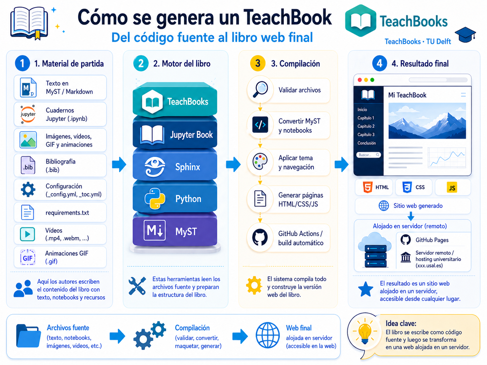
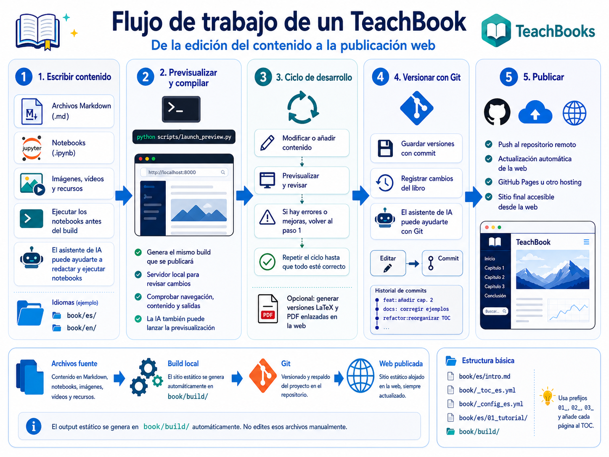
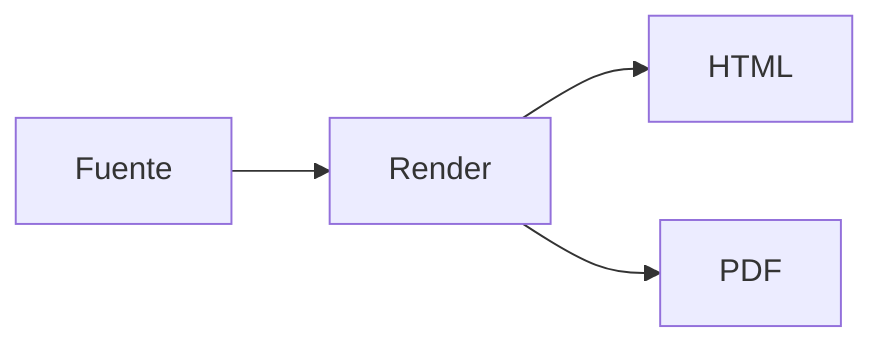
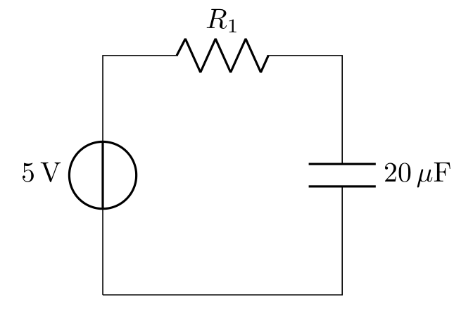
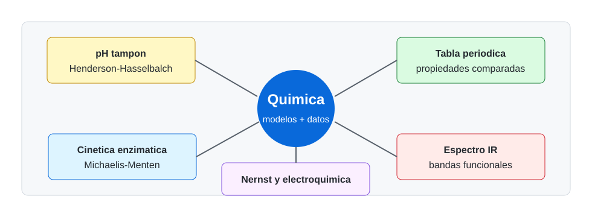

# Elaboración de libros electrónicos mediante código y asistentes de IA

<p class="subtitle">Resumen docente del TeachBook y de la plantilla</p>

---

# Índice

<div class="teachbook-grid">
  <div class="teachbook-card">
    <strong>1. Qué es</strong>
    <span>Libro web, PDF y materiales asociados desde fuentes editables.</span>
  </div>
  <div class="teachbook-card">
    <strong>2. Cómo se trabaja</strong>
    <span>Escribir, previsualizar, versionar y publicar.</span>
  </div>
  <div class="teachbook-card">
    <strong>3. Contenido docente</strong>
    <span>Figuras, ecuaciones, tablas, citas, diagramas y multimedia.</span>
  </div>
  <div class="teachbook-card">
    <strong>4. Interactividad</strong>
    <span>Notebooks, Thebe, widgets, quizzes y HTML ligero.</span>
  </div>
</div>

---

# La idea base

::div{class="teachbook-two-cols"}

::div
Un TeachBook parte de archivos sencillos y genera una web docente navegable.

- Markdown y notebooks como fuente
- Assets estáticos compartidos
- Configuración por idioma
- Salida web y PDF
::

::div
<figure class="teachbook-figure">
  
  <figcaption>Contenido editable que se transforma en material publicable.</figcaption>
</figure>
::

::

---

# Flujo de trabajo

<figure class="teachbook-wide-figure">
  
</figure>

<div class="teachbook-callout">
El objetivo de la plantilla es que el profesorado no tenga que memorizar comandos: las skills y los scripts ejecutan el flujo por él.
</div>

---

# Contenidos básicos que cubre la plantilla

::div{class="teachbook-two-cols"}

::div
**Elementos habituales**

- Figuras con texto alternativo
- Ecuaciones LaTeX
- Tablas y referencias cruzadas
- Citas BibTeX
- Vídeo, audio y multimedia
::

::div
**Ejemplo de sintaxis**

````md
```{figure} ../../_static/logo.png
:alt: Logo del libro
:width: 50%

Logo del libro.
```
````
::

::

---

# Diagramas desde texto

::div{class="teachbook-two-cols"}

::div
Los diagramas se mantienen como fuente editable y se publican como imágenes estables para HTML y PDF.


::

::div
<figure class="teachbook-figure">
  
  <figcaption>Ejemplo renderizado desde Mermaid/Kroki.</figcaption>
</figure>
::

::

---

# Ejemplos por grado

<div class="teachbook-grid">
  <div class="teachbook-card">
    <strong>Física</strong>
    <span>Circuitos, ajuste de datos, oscilador armónico y diagramas.</span>
  </div>
  <div class="teachbook-card">
    <strong>Química</strong>
    <span>pH, cinética, tabla periódica, espectro IR y Nernst.</span>
  </div>
  <div class="teachbook-card">
    <strong>Matemáticas</strong>
    <span>Newton, transformaciones lineales y distancias unitarias.</span>
  </div>
  <div class="teachbook-card">
    <strong>Informática</strong>
    <span>ER, UML, diagramas y complejidad algorítmica.</span>
  </div>
</div>

---

# Física y Química como muestra

::div{class="teachbook-two-cols"}

::div
<figure class="teachbook-figure compact">
  
  <figcaption>Circuito RC generado como imagen reutilizable.</figcaption>
</figure>
::

::div
<figure class="teachbook-figure compact">
  
  <figcaption>Mapa de recursos docentes de Química.</figcaption>
</figure>
::

::

---

# Interactividad y evaluación

| Recurso | Uso docente | PDF |
|---|---|---|
| Ejercicios con solución | práctica guiada | sí |
| Thebe + Binder | código ejecutable remoto | no |
| Notebooks | cálculo reproducible | parcial |
| Widgets | exploración de parámetros | no |
| Quizzes | comprobación rápida | no |

<div class="teachbook-callout">
La recomendación del libro es empezar por lo simple y añadir interactividad solo donde aporte valor docente.
</div>

---

# Anotar durante la clase

Las anotaciones de Slidev están activadas en esta deck.

- Usa el botón de dibujo de la barra de Slidev durante la presentación.
- Escribe, subraya o marca zonas de interés.
- La configuración `drawings.persist: true` permite conservar esas anotaciones como dibujos asociados a la presentación.

<div class="teachbook-callout">
Útil para resolver ejercicios en directo, marcar una figura o recoger ideas durante una discusión.
</div>

---

# Cierre

<div class="teachbook-final">
  <h2>Un buen material docente combina libro, web, PDF y diapositivas.</h2>
  <p>La plantilla deja preparado el flujo completo para escribir una vez y publicar en varios formatos.</p>
</div>
